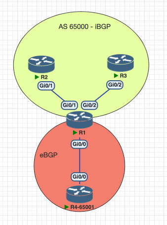
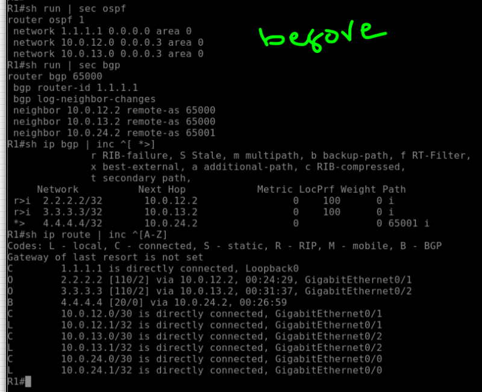
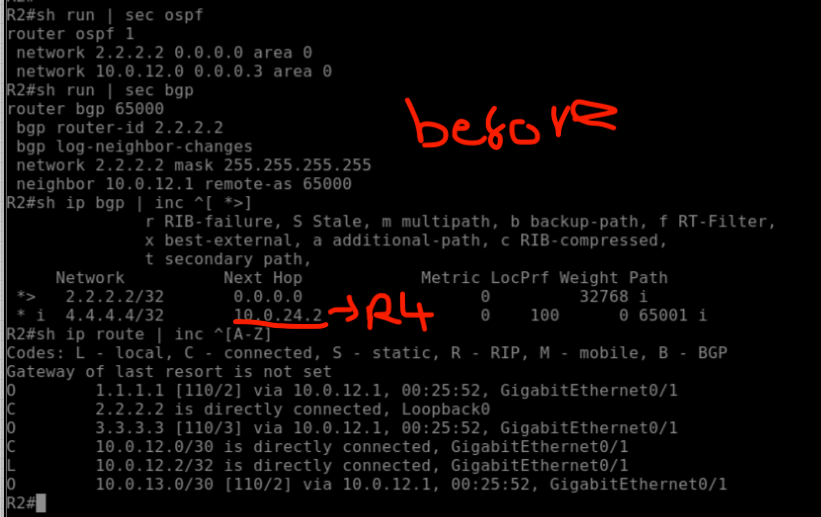
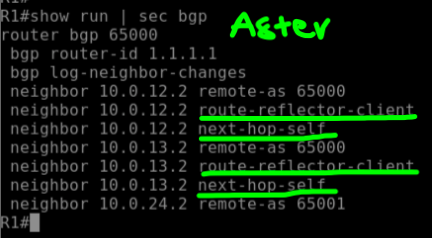
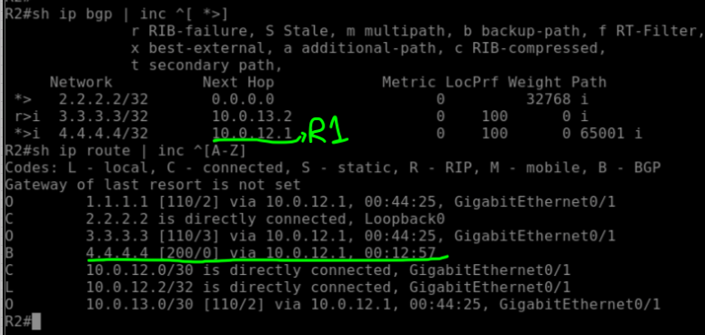
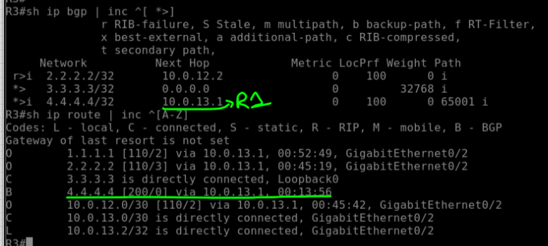

# iBGP Lab: Route Reflector & Next-Hop Self

## Overview

This lab demonstrates key iBGP concepts:

* iBGP split-horizon  
* Route Reflector (RR)  
* Next-Hop Self  

Goal: Understand how iBGP behaves in non-full-mesh topologies and how RR + next-hop-self solve route propagation issues. OSPF is used between the iBGP peers for reachability.

---

## Topology

**Devices:**

* R1 → Route Reflector (AS 65000)  
* R2, R3 → iBGP Clients  
* R4 → eBGP Peer (AS 65001)  

---

## IP Addressing

| Device | Loopback   | Links                                                         |
| ------ | ---------- | ------------------------------------------------------------- |
| R1     | 1.1.1.1/32 | R1-R2: 10.0.12.1/30, R1-R3: 10.0.13.1/30, R1-R4: 10.0.24.1/30 |
| R2     | 2.2.2.2/32 | R1-R2: 10.0.12.2/30                                           |
| R3     | 3.3.3.3/32 | R1-R3: 10.0.13.2/30                                           |
| R4     | 4.4.4.4/32 | R1-R4: 10.0.24.2/30                                           |

---

## Before RR & Next-Hop Self

- R1 sees the `2.2.2.2` and `3.3.3.3` networks from its iBGP peers but **does not advertise them** due to the iBGP split-horizon rule.  
- R1 sees `4.4.4.4` from its eBGP peer and advertises it to iBGP peers **without rewriting the next-hop**, which is a problem because there is no route to R4 in the routing table of R2 and R3.

  
  

---

## After RR & Next-Hop Self

- R1 is configured as a **Route Reflector** for its iBGP peers → R2 sees `3.3.3.3` and R3 sees `2.2.2.2`.  
- R1 is configured with **Next-Hop Self** → R2/R3 now see `4.4.4.4` with next-hop R1, and the route is installed in the routing table.

  
  

---
